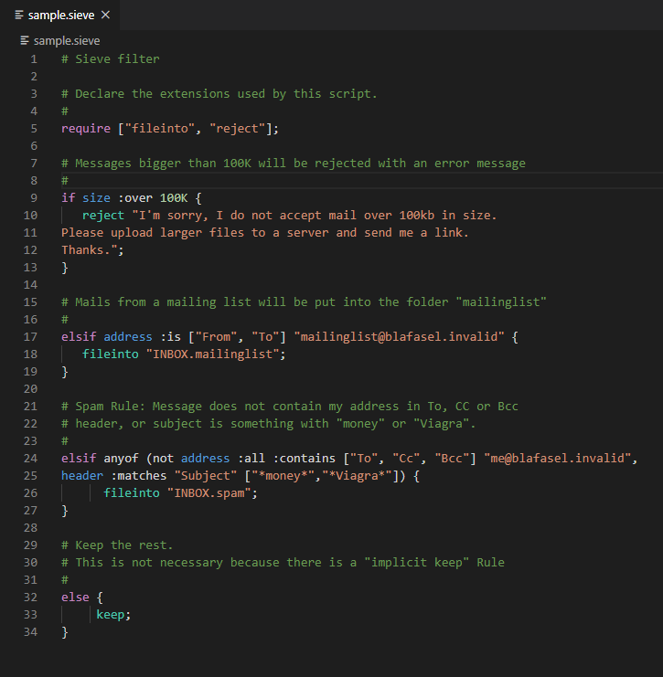

# Sieve syntax highlight support

## About

Syntax highlight support for [Sieve mail filtering language](https://en.wikipedia.org/wiki/Sieve_(mail_filtering_language)).

## Example

## Release Notes

Please consult [Changelog](CHANGELOG.md) for version history.

## License

This extension was initiated with the tmLanguage file of [**Irae Carvalho** language highlight support for SublimeText](https://github.com/irae/Sieve-sublime-package) under [MIT license](https://github.com/irae/Sieve-sublime-package/blob/master/LICENSE).  

[MIT license](LICENSE.md) AdZero (Anthony DUPRET)
